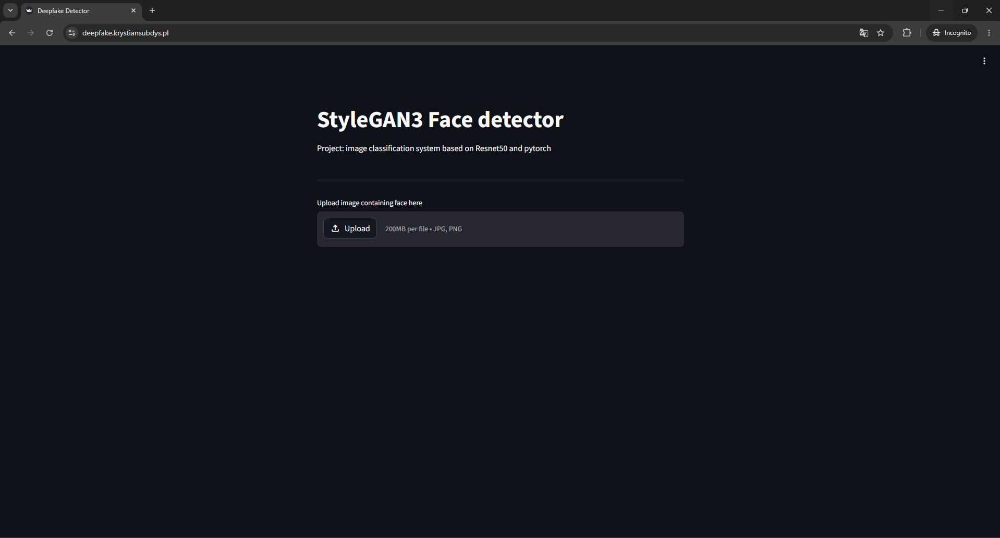
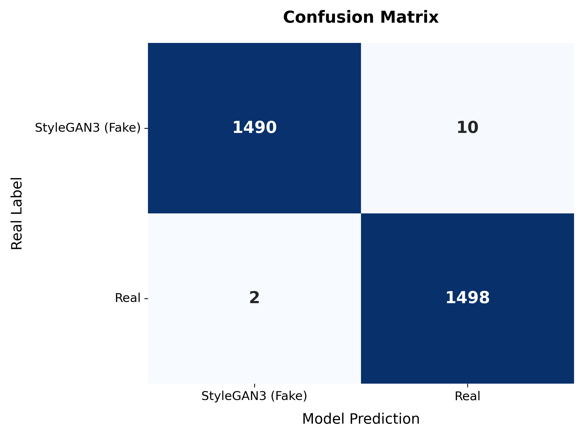
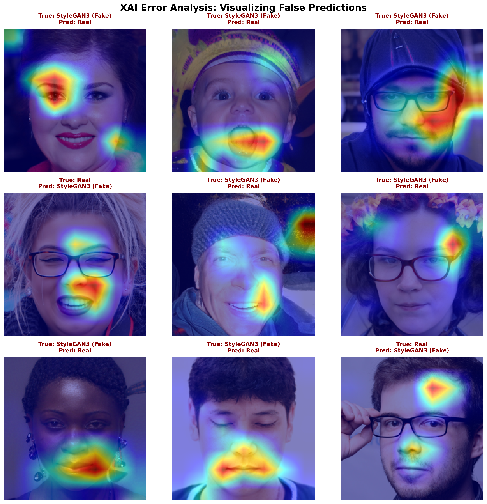

# StyleGAN3 Deepfake Detector API

[](https://www.python.org/)
[](https://pytorch.org/)
[](https://fastapi.tiangolo.com/)
[](https://streamlit.io/)
[](https://www.docker.com/)

An end-to-end Machine Learning pipeline and web application designed to detect AI-generated faces (StyleGAN3) with high confidence. The system features a two-stage inference architecture, Explainable AI (XAI) for decision transparency, and is fully containerized for cloud deployment.

**Live Demo:** [https://deepfake.krystiansubdys.pl](https://deepfake.krystiansubdys.pl)



---

## System Architecture (Two-Stage Pipeline)

To ensure the model performs accurately on raw, uncropped images uploaded by users (in-the-wild data), the inference pipeline is split into two distinct stages:

1. **Face Detection & Extraction (MediaPipe):** The uploaded image is first processed by Google's MediaPipe Face Detection model. The primary face is identified, dynamically padded, and cropped.
2. **Deepfake Classification (ResNet50):** The isolated face is then normalized and passed through a fine-tuned ResNet50 model (PyTorch) to classify whether the face is `Real` or `StyleGAN3 (Fake)`.


---

## Key Features & MLOps Practices

* **Robust Data Pipeline:** Custom PyTorch `Dataset` and `DataLoader` implementations with strict `torchvision.transforms.v2` augmentations (RandomResizedCrop, v2.JPEG and RandomHorizontalFlip) to prevent overfitting.
* **Data Leakage Prevention:** Fixed and frozen data splits (Train/Val/Test) exported to CSVs to ensure 100% experiment reproducibility.
* **Explainable AI (XAI):** Integrated **Grad-CAM** to visualize which facial features (e.g., specific artifacts in hair or background) trigger the model's "Fake" prediction.
* **Decoupled Architecture:** The system separates the training logic (PyTorch Lightning), inference API (FastAPI), and presentation layer (Streamlit).

---

## Evaluation & Explainability

The model was rigorously evaluated on an unseen test set, avoiding the common training-serving skew by maintaining absolute preprocessing parity between the training script and the production API.

### Confusion Matrix & Metrics


### What fools the model? (Grad-CAM Error Analysis)
To understand the model's blind spots, Grad-CAM heatmaps were generated for misclassified images. This highlights the precise pixel regions that led to false positives/negatives, allowing for targeted dataset improvements in the future.



---

## Tech Stack

* **Deep Learning:** PyTorch, PyTorch Lightning, Torchvision
* **Computer Vision:** MediaPipe (Face Detection), PIL, OpenCV
* **Backend:** FastAPI, Uvicorn, Python-multipart
* **Frontend:** Streamlit, Requests
* **Data & Analytics:** Pandas, Scikit-learn, Matplotlib, Seaborn, Grad-CAM
* **Infrastructure:** Docker, Linux (GCP), Caddy (SSL Reverse Proxy)

---

## Local Setup (Docker)

The easiest way to run the entire system locally is via Docker.

1. Clone the repository:
   ```bash
   git clone https://github.com/Kacpi-PL/deepfake-detector.git
   cd deepfake-detector
   ```

2. Build and run the containers:
   ```bash
   docker-compose up --build
   ```

3. Access the application:
   * **Streamlit UI:** `http://localhost:8501`
   * **FastAPI Docs (Swagger):** `http://localhost:8000/docs`

---

*Project developed as part of an ML engineering portfolio. Model weights are trained on a subset of the Real vs StyleGAN3 dataset.*