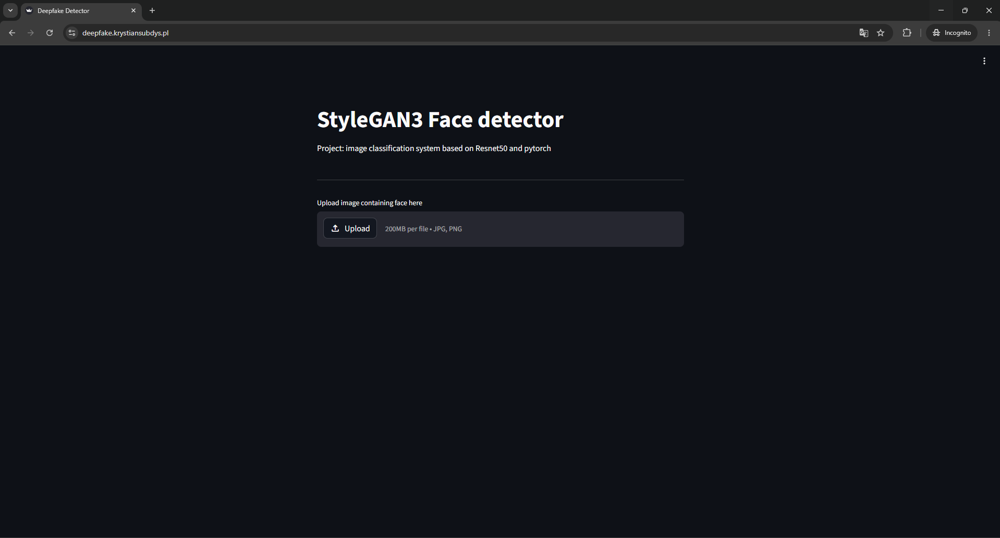
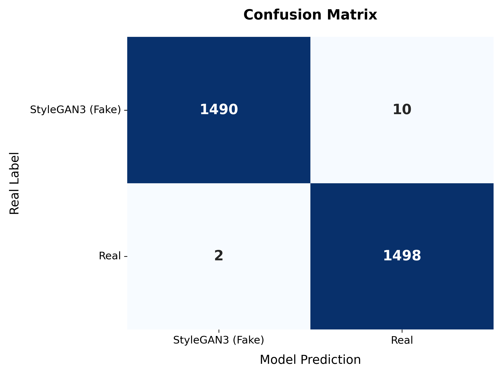
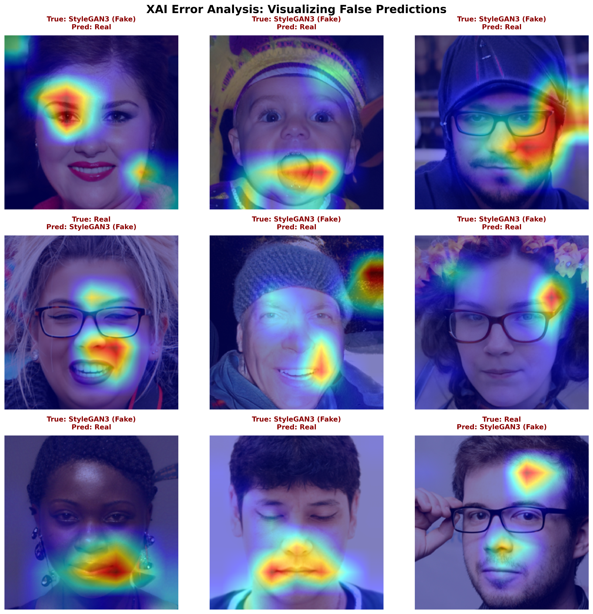

# StyleGAN3 Deepfake Detector API

[](https://www.python.org/)
[](https://pytorch.org/)
[](https://fastapi.tiangolo.com/)
[](https://streamlit.io/)
[](https://www.docker.com/)

An end-to-end Machine Learning pipeline and web application designed to detect **StyleGAN3-generated** faces. The system features a two-stage inference architecture, Explainable AI (XAI) for decision transparency, and is fully containerized for cloud deployment.

> **Scope note:** This is a *specialist* StyleGAN3 detector, not a general "is this AI?" classifier. Its real-world behaviour and failure modes are documented honestly in [Known Limitations](#known-limitations--weaknesses) — please read that section before interpreting the metrics below.

**Live Demo:** [https://deepfake.krystiansubdys.pl](https://deepfake.krystiansubdys.pl)



---

## System Architecture (Two-Stage Pipeline)

To ensure the model performs accurately on raw, uncropped images uploaded by users (in-the-wild data), the inference pipeline is split into two distinct stages:

1. **Face Detection & Extraction (MediaPipe):** The uploaded image is first processed by Google's MediaPipe Face Detection model. The primary face is identified, dynamically padded, and cropped.
2. **Deepfake Classification (ResNet50):** The isolated face is then normalized and passed through a fine-tuned ResNet50 model (PyTorch) to classify whether the face is `Real` or `StyleGAN3 (Fake)`.


```mermaid
graph LR
    A[User Image] --> B[FastAPI Backend]
    B --> C[MediaPipe Face Crop]
    C --> D[ResNet50 Classifier]
    D --> E[JSON Prediction]
    E --> F[Streamlit UI]
```

---

## Key Features & MLOps Practices

* **Robust Data Pipeline:** Custom PyTorch `Dataset` and `DataLoader` implementations with strict `torchvision.transforms.v2` augmentations (RandomResizedCrop, v2.JPEG and RandomHorizontalFlip) to prevent overfitting.
* **Data Leakage Prevention:** Fixed and frozen data splits (Train/Val/Test) exported to CSVs to ensure 100% experiment reproducibility.
* **Explainable AI (XAI):** Integrated **Grad-CAM** to visualize which facial features (e.g., specific artifacts in hair or background) trigger the model's "Fake" prediction.
* **Decoupled Architecture:** The system separates the training logic (PyTorch Lightning), inference API (FastAPI), and presentation layer (Streamlit).

---

## Evaluation & Explainability

The model was evaluated on a held-out test set drawn from the **same distribution** as training. The figures below therefore represent an **in-distribution ceiling**, not real-world accuracy — see [Known Limitations](#known-limitations--weaknesses) for the gap between this benchmark and in-the-wild performance.

### Confusion Matrix & Metrics


### What fools the model? (Grad-CAM Error Analysis)
To understand the model's blind spots, Grad-CAM heatmaps were generated for misclassified images. This highlights the precise pixel regions that led to false positives/negatives, allowing for targeted dataset improvements in the future.



---

## Known Limitations & Weaknesses

This model is a **specialist, not a general AI-image detector.** It was tested on in-the-wild images, and its boundaries are stated here honestly:

* **Single generator (StyleGAN3 only).** Trained exclusively on Real vs. StyleGAN3 faces, it does **not** reliably detect other sources (other GANs, diffusion models such as Midjourney/SDXL, etc.). A `Real` verdict means *"not StyleGAN3"* — **not** *"not AI-generated."*
* **Sensitive to compression.** The classifier keys on high-frequency generative artifacts. Heavy JPEG compression smooths these away, so hard-compressed StyleGAN3 faces are frequently **missed (false negatives)**. The current training augmentation only simulates light compression (quality 80–100), leaving heavily compressed web images out of distribution.
* **Watermarks & overlays.** Text watermarks or graphics over a face mask the artifact regions the model relies on, leading to misclassification.
* **Benchmark vs. reality gap.** The reported confusion matrix / F1 come from a held-out test set in the *same distribution* as training. This is an **in-distribution ceiling** and is **not** representative of real-world accuracy, which is lower — especially on compressed or non-StyleGAN3 inputs.
* **Small / distant / occluded faces.** Small in-frame faces are upscaled before classification, destroying the fine texture the model depends on; reliability drops accordingly.

These were verified by manual in-the-wild testing: real faces are classified correctly almost always, while StyleGAN3 misses cluster on **compressed** and **watermarked** images — consistent with an artifact-based detector.

## Future Work

* **Stronger degradation augmentation** — aggressive JPEG (quality 30–90) plus random down/up-scaling during training, to harden the model against the compressed web images where it currently fails.
* **Train/serve preprocessing parity** — align the inference face-crop with the training crop (calibrated MediaPipe margins, fit-square framing, no padding) so the model is served the exact framing it learned on.
* **Multi-generator support** — extend the dataset and the (already 2-logit) head toward detecting additional generators, moving from a StyleGAN3 specialist toward a general detector.
* **Confidence-aware abstention** — return *"uncertain / no face detected"* instead of forcing a Real/Fake verdict on ambiguous inputs.

---

## Tech Stack

* **Deep Learning:** PyTorch, PyTorch Lightning, Torchvision
* **Computer Vision:** MediaPipe (Face Detection), PIL, OpenCV
* **Backend:** FastAPI, Uvicorn, Python-multipart
* **Frontend:** Streamlit, Requests
* **Data & Analytics:** Pandas, Scikit-learn, Matplotlib, Seaborn, Grad-CAM
* **Infrastructure:** Docker, Linux (GCP), Caddy (SSL Reverse Proxy)

---

## Local Setup (Docker)

The easiest way to run the entire system locally is via Docker.

1. Clone the repository:
   ```bash
   git clone https://github.com/Kacpi-PL/deepfake-detector.git
   cd deepfake-detector
   ```

2. Build and run the containers:
   ```bash
   docker-compose up --build
   ```

3. Access the application:
   * **Streamlit UI:** `http://localhost:8501`
   * **FastAPI Docs (Swagger):** `http://localhost:8000/docs`

---

*Project developed as part of an ML engineering portfolio. Model weights are trained on a subset of the Real vs StyleGAN3 dataset.*